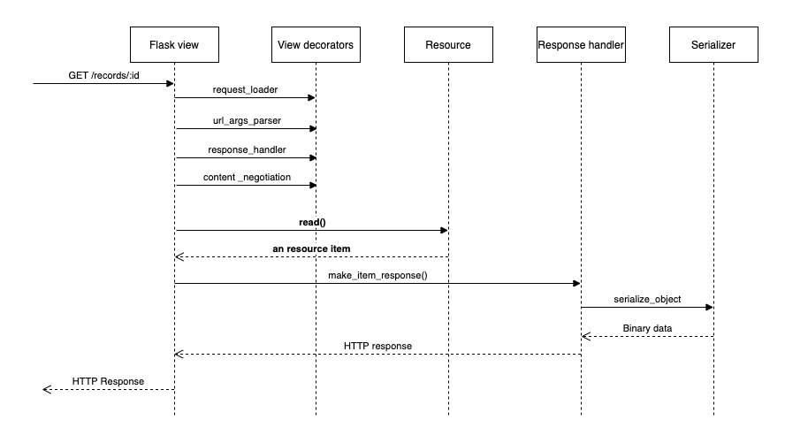
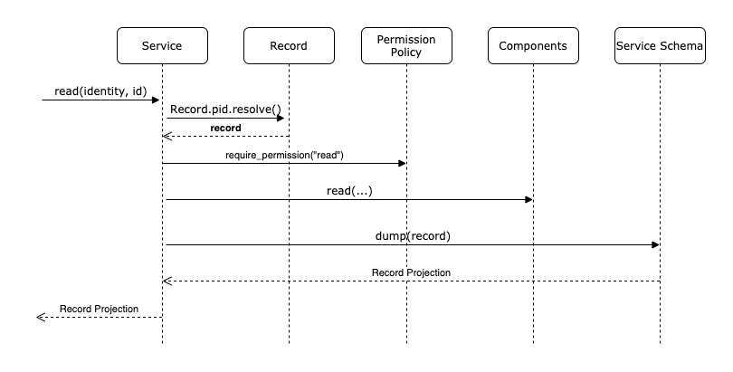

# Small Flask-Resources app

Running:

```console
export FLASK_APP=app.py
export FLASK_ENV=development
flask run
```

Testing:

```console
curl -X GET -H "Accept: text/plain" http://127.0.0.1:5000/records/
curl -X GET -H "Accept: application/json" http://127.0.0.1:5000/records/
curl -X GET -H "Accept: text/plain" http://127.0.0.1:5000/records/1
```

### Request handling (Presentation Layer)



### Service layer (Invenio-Records-Resources)


